# KeytestBox

> A modular embedded platform designed to integrate automotive HMI key-testing systems in production lines.

> This project was developed at Preh Portugal as part of my Master’s thesis.

---

## Table of Contents

- [Introduction](#introduction)
- [Typical Key Test Output](#typical-key-test-output)
- [Incremental vs Continuous Tests](#incremental-vs-continuous-tests)
  - [Incremental Tests](#incremental-tests)
  - [Continuous Tests](#continuous-tests)
- [Problem Statement](#problem-statement)
  - [Problem 1: Delay via CAN/LIN](#problem-1-delay-when-reading-uut-data-via-can-or-lin)
  - [Problem 2: Low resolution and missed events](#problem-2-low-resolution-and-missed-events-in-incremental-tests)
  - [Consequence](#consequence-forced-to-use-expensive-continuous-test-systems)
- [Solution, Main Goals and Requirements](#solution-main-goals-and-requirements)
  - [Main Goals](#main-goals)
  - [Hardware Requirements](#hardware-requirements)
  - [Software Requirements](#software-requirements)
- [Hardware Overview](#hardware-overview)
- [Final Hardware](#final-hardware)
- [Software and Tools Used](#software-and-tools-used)
- [MQTT Commands Implemented](#mqtt-commands-implemented)
- [Tests and Results](#tests-and-results)
  - [UUT Lever and Testbench Setup](#uut-lever-under-test-and-testbench-setup)
  - [Sampling and Performance](#sampling-and-performance)
- [Conclusion](#conclusion)
- [Skills Learned](#skills-learned)

---

## Introduction 

Automotive HMI, such as climate and central control panels, rely on high-quality tactile feedback. **Force–displacement** key tests quantify that feel essencially by measuring the relation between **applied force** and **key travel**.

Images below display the **main components** of a key test system

<table>
  <tr>
    <td style="padding-right: 40px;">
      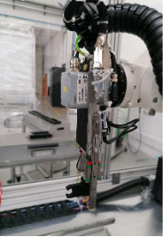
    </td>
    <td style="padding-left: 40px;">
      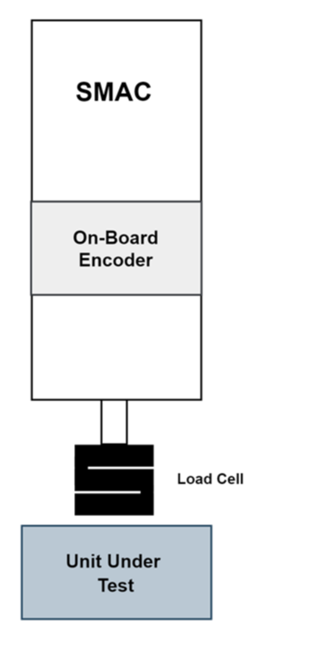
    </td>
  </tr>
</table>

### During a test:
- The key is pressed by a **SMAC linear motor**  
- **Force** is measured using a **load cell with an amplifier**  
- **Key travel (displacement)** is obtained from the **SMAC internal encoder**  
- The **Unit Under Test (UUT)** sends data via **CAN/LIN** during the test, such as:  
  - **Key state (pressed / released)**
  - **Lever position or angle** (e.g. gear selector tests)  
  - **Selected gear value**  
  - **UUT Hall sensors or internal position data**  
  - Other diagnostic or status information

### Typical Key Test Output

The **Force–Displacement** curve is the most common way to characterize how a key or button behaves when it is pressed and released. It represents the force applied to the key as a function of its travel (displacement).

  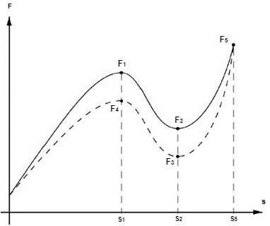

Curves differ depending on the type of key being tested.
During a test, the key is pressed (force increases) until it reaches a maximum point, and then released. From this curve, mechanical parameters of the key can be extracted:

| Symbol | Description |
|--------|-------------|
| **S1** | Displacement at which the key actuates (snap/collapse point). |
| **F1** | Actuation force – force required to trigger the snap of the membrane or key mechanism at S1. |
| **S2** | Displacement where electrical contact occurs with the PCB. |
| **F2** | Contact force – minimum force required to close the electrical contact at S2. |
| **F3** | Return force – force at which the electrical contact is released during the return movement. |
| **F4** | Force difference between actuation and release states. |
| **F5** | Maximum applied force during the test (should not exceed mechanical limits). |
| **Ss** | Maximum travel / end of mechanical stroke. |

One of the most important metrics derived from this curve is the **Snap Ratio (SR)**, which indicates how strong the tactile feedback is:

$$
SR=\dfrac{F_1-F_2}{F_1}\times 100\%
$$

- A higher **Snap Ratio** = stronger tactile feedback (more noticeable “click”).
- A lower **Snap Ratio** = softer feedback, which may feel smoother but less perceptible.
- Ideal **SR** values depend on the application.

---

## Incremental vs Continuous Tests

The flowcharts below provide a simplified comparison between the two testing methods.  
The main difference is that in **Incremental Tests**, the actuator stops at each step to acquire a sample, while in **Continuous Tests**, the actuator moves without stopping and data is sampled in real time.

<table align="center">
  <tr>
    <td align="center">
      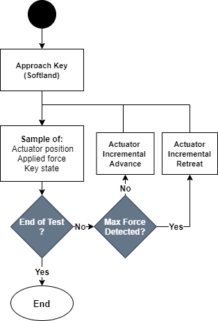 
      <em>Incremental Test Flowchart</em>
    </td>
    <td align="center">
      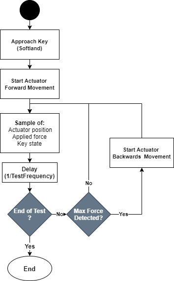 
      <em>Continuous Test Flowchart</em>
    </td>
  </tr>
</table>

---

## Incremental Tests

### Incremental Test System Example (without the KeyTestBox)

  

- **Force** data is acquired by the host PC via a USB Data Acquisition (DAQ) device from National Instruments.
- **Position** data is acquired by RS232 from the actuator controller
- **Key State or info** data is acquired through a CAN/LIN-USB converter

### Advantages:
- Low cost
- Easier to implement

### Disadvantages
- **low test resolution** (low sample density)
- May miss the sampling of the **snap point**, especially on **short-travel keys**
- Can fail to meet client requirements

### Incremental Test Output Example

  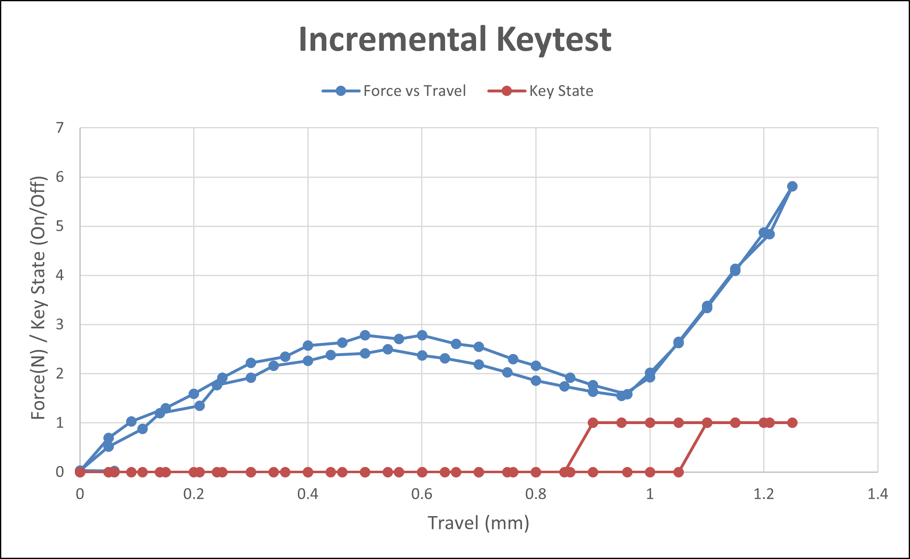

---

## Continuous Tests

### Continuous Test System (Without KeyTestBox)

  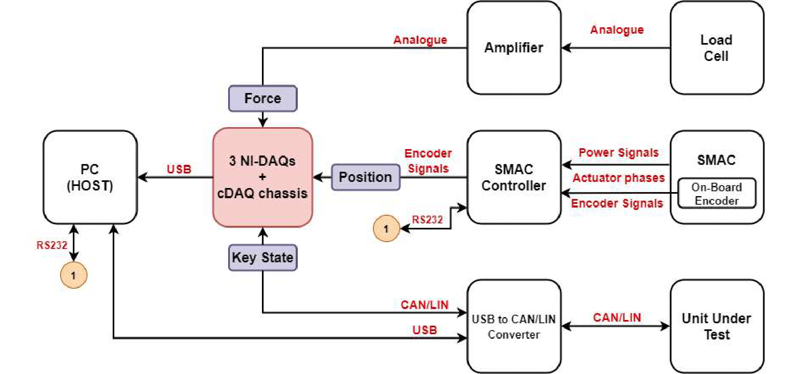

In continuous testing, the actuator **moves without stopping**, and all signals are sampled in real time. This enables a smoother force–displacement curve and higher data accuracy.

- **Force** is measured by a load cell and continuously acquired via the DAQ system  
- **Position (travel)** is obtained from the SMAC actuator encoder in real time  
- The **Unit Under Test (UUT)** transmits its state (CAN/LIN), such as key/lever status or sensor values, during movement  
- All data is timestamped and saved by the DAQ system for later processing  

> While this setup delivers high accuracy and resolution, it uses sophisticated hardware and is **significantly more expensive**.

### Advantages
- **High sample density** → more precise force–travel curve  
- **Accurate snap detection**  
- **Faster test execution** → important in industrial production environments  

### Disadvantages
- **Substantially higher cost** due to DAQ modules and synchronization hardware.

### Continuous Test Output Example

  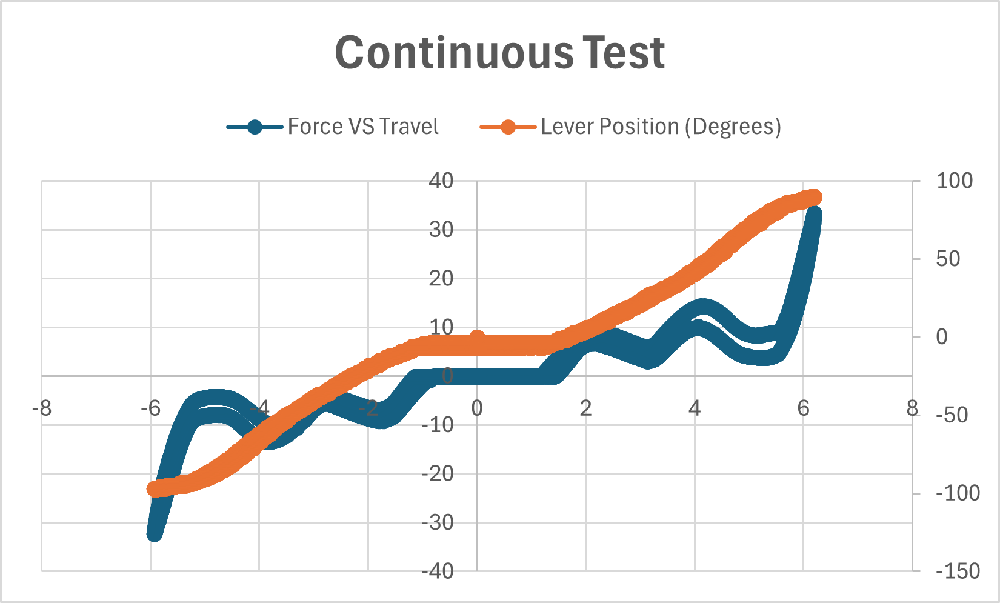

---

## Problem Statement

In industrial test setups, especially for testing mechanical keys, the most common approach is the **incremental test method**. This approach is simple and cost-effective, and it can work well in many cases.

However, **in several real-world situations, incremental testing is not sufficient or may not work at all**. These limitations arise due to the way the test equipment communicates and the type of measurements required:

---

### Problem 1: Delay when reading UUT data via CAN or LIN

Many devices under test (UUTs) only report their internal state (e.g., whether a button is pressed or not) when the host explicitly **requests the data** using a communication protocol like **CAN** or **LIN**. This process introduces a delay between the request and the response.

If the actuator is moving during this time (as in a continuous test), by the time the host receives the data, the key is already in a **different position**, and the measured force has also changed. This causes a mismatch between the **key state**, **position**, and **force**, making the data unreliable.

  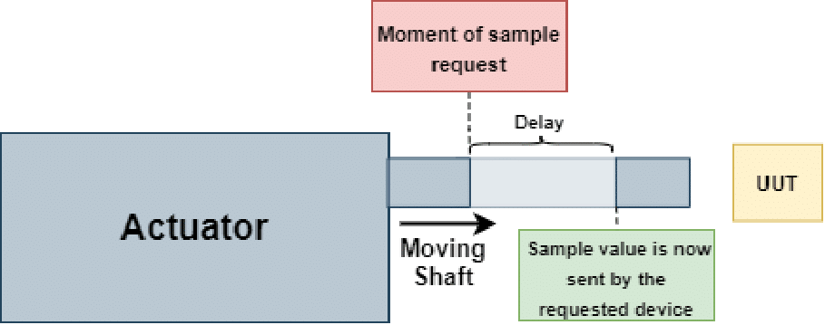

---

### Problem 2: Low resolution and missed events in incremental tests

Given the problem 1, a good solution would be to **stop the actuator** and only then **request the data via CAN or LIN**, then wait for the response.  
However, as said before, **incremental testing has limited resolution**. Since the actuator only samples at discrete steps, fast or short events — such as the **snap point** (a sudden change in force when pressing a key) — may occur between two sample points and go undetected.

This is particularly problematic for **short-travel keys**, where the full keypress happens in a very small movement range. In such cases, a small number of samples is not enough to capture the key’s behavior accurately.

---

### Consequence: Forced to use expensive continuous test systems

To solve these problems, test stations often switch to **continuous testing**, which are significantly more expensive

---

## Solution, Main Goals and Requirements

To overcome the limitations of incremental testing and avoid the high cost of commercial continuous testing systems, a new solution is required — one that enables **real-time, synchronized testing** without the complexity and price of traditional DAQ systems.

The **KeyTestBox** is proposed as a **low-cost**, **modular**, and **reusable** platform suitable for production testing environments.

### Main Goals 

- **Real-time acquisition** of:
  - **Force** (via load cell)
  - **Position** (via SMAC encoder)
  - **UUT data** (via CAN or LIN protocols)

### Hardware Requirements

- 24 VDC power supply  
- CAN interface (supports baud rate up to 1 Mbps)  
- LIN interface (supports baud rate up to 19 200 bps)  
- Ethernet port (10/100 Mbps)  
- Two RS232 interfaces  
- Minimum of five differential analog inputs (−10 V to +10 V) **(Mainly to read the 2 Load Cells but some extra were added)**  
- Two linear encoder counters  
- Microcontroller-based system
- PCB design

---

### Software Requirements

- Start and stop a test routine upon request  
- Ability to export the acquired test data  
- Capability to execute external commands during the test routine  
- Use of the MQTT (Message Queuing Telemetry Transport) protocol for communication with the host  
- Firmware developed in C

---

## Hardware Overview

  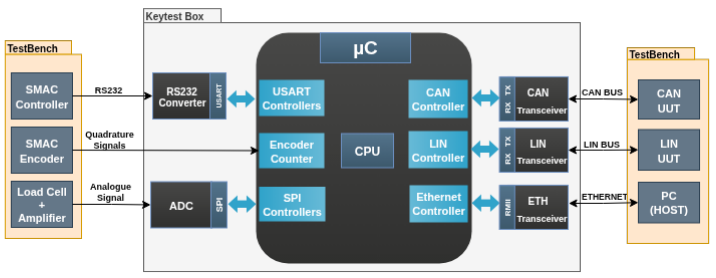

---

## Final Hardware

[Full **Hardware Schematic**](PCB/keytestbox_schematic.pdf)

### Main Components

- STM32F767VIT6
- LAN8742A
- 2x MAX1032 (ADC)
- MCP2021 (LIN)
- MCP2551 (CAN)
- MAX232 (RS232 Converter) 
- STLINK-V3 Debugger SWD
 
<table align="center">
  <tr>
    <td align="center">
       
      <em>Real KeytestBox Image</em>
    </td>
    <td align="center">
      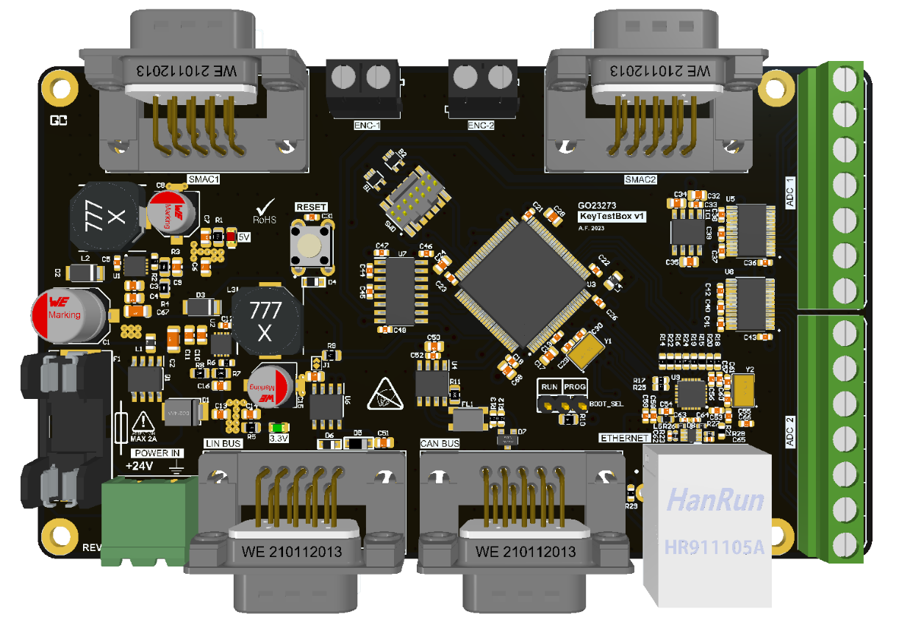 
      <em>3D model of the KeyTestBox enclosure</em>
    </td>
  </tr>
</table>

> PCB Schematic done by me in KiCad
> PCB Layout was designed by another company
---

## Software and Tools used

- STM32Cube IDE
- FreeRTOS
- LwIP IP Stack
- Mosquitto MQTT
- Percepio Tracealyzer

---

## MQTT Commands Implemented

  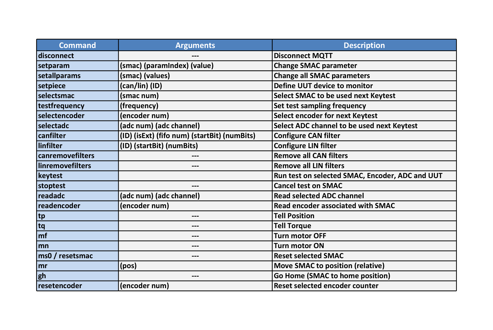

---

## Tests and Results

The primary test target was a **gear shift lever** from the UUT shown below. This lever represents one of the most challenging components to test due to several factors:

- The lever travel is **approximately 12 mm**, much longer than typical pushbuttons (≈ 3 mm).
- Each test cycle includes **two snap events** in each direction (forward and return).
- The UUT transmits a **high volume of CAN data** during movement, requiring reliable high-frequency acquisition and synchronization.

### UUT Lever Under Test and Testbench Setup

  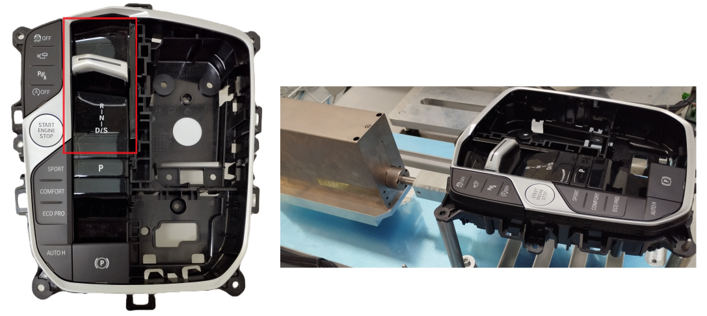

The figure highlights the tested lever in red and shows the complete testbench used.

---

### Sampling and Performance

Tests were conducted at various sampling frequencies. The system successfully performed synchronized data acquisition at rates **up to 3000 Hz**, capturing:

- **Force data** via load cell  
- **Position data** from the SMAC actuator encoder  
- **Key state data** via CAN from the UUT

This sampling rate proved sufficient for accurate detection of all snap points and detailed force-position profiles.

> Increasing the frequency beyond 3000 Hz was not necessary and led to **excessive data**, which becomes impractical to store locally due to **RAM constraints**.

### Test Result Graph @3000Hz + Lever Position 

  

### Test Result Graph @1250Hz + Gear Selected

  

---

## Conclusion

All the defined requirements were met.
Furthermore, the tests demonstrated that the KeyTestBox platform is fully capable of performing continuous key testing with:

- High-resolution data acquisition up to **3000 Hz**
- Data synchronization
- Successful operation even on demanding UUT test cases

> The **KeyTestBox achieved a cost reduction of approximately 91.75%**, lowering the price about 12 times comparing to the other solution

> One limitation was the available RAM, which is sufficient for most use cases. However, for UUTs that transmit **large volumes of CAN data**, it may be necessary to **select only the relevant signals** to avoid memory overflow.  
>  
> If full data capture is required, this limitation can easily be addressed by using a **microcontroller with more RAM**, for example STM32H7 family.

---

## Skills Learned

This project provided practical experience in the design and implementation of a **cyber-physical embedded system** for industrial testing applications.

### General Skills
- **Real-Time Embedded Systems**
- **Cyber-Physical System Design**  
- **Signal and Data Acquisition**
- **Cost–Performance Trade-Offs**

### Technical Skills
- **Embedded C (STM32)**
- **FreeRTOS task design**
- **Peripheral integration** — SPI, UART, ADC, CAN, LIN, Encoders, Timers
- **Networking with LwIP + MQTT**
- **PCB schematic design (KiCad)**

